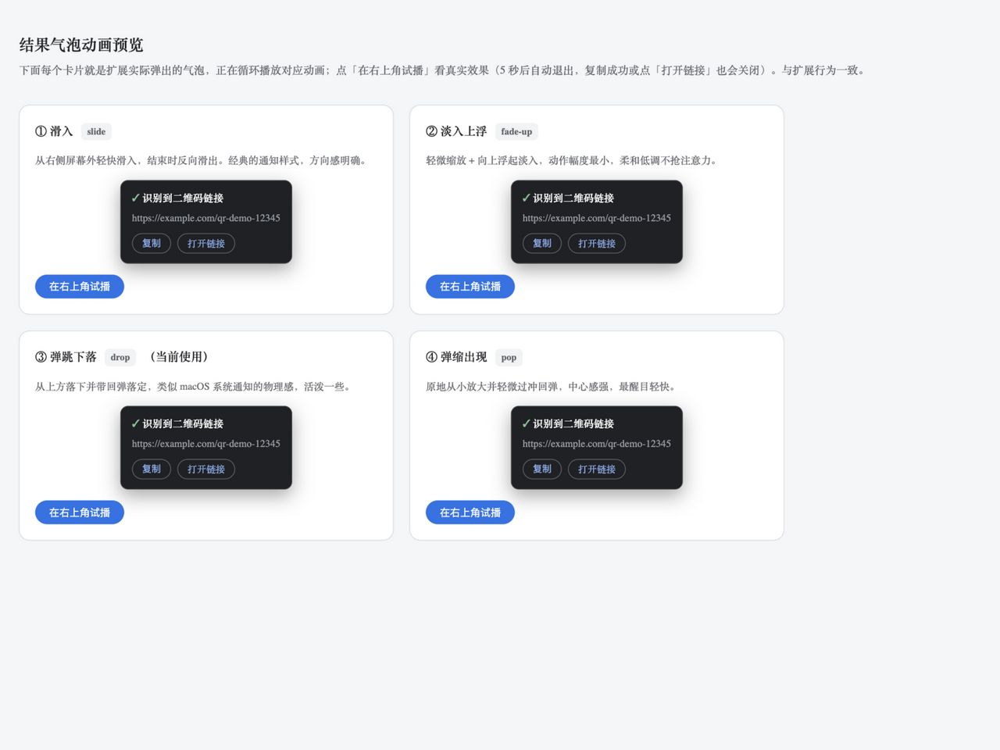

# QR Code Reader for Edge / Chrome

**中文文档**: [README.md](README.md)

Right-click any image on a web page to decode the QR code inside it. The result pops up in the corner with one-click copy / open. **100% local decoding — nothing is uploaded.**

## Features

- **Right-click to decode** — a "识别图中二维码" (Decode QR in this image) item appears in the context menu on any image
- **Result popup** — decoded content drops into the top-right corner with a bounce animation, auto-dismisses after 5 s
- **Copy / Open** — copy button and open-link button inside the popup; the popup closes after you act
- **Broad image support** — cross-origin images, `blob:`/`data:` inline images, `srcset` variants, inverted QR codes; oversized images are downscaled before decoding
- **Non-URL content** — plain text, vCard, WiFi credentials etc. are shown and copyable too
- **Private by design** — decoding runs entirely in your browser via [jsQR](https://github.com/cozmo/jsQR); no network requests, no data collection
- **Lightweight** — no persistent content scripts (injected only on menu click), no background polling

## Install

1. Download the latest `qr-reader-edge-extension.zip` from [Releases](https://github.com/clown-sacco/qr-reader-edge-extension/releases) and unzip it (or clone this repo)
2. Open `edge://extensions` (or `chrome://extensions`)
3. Enable **Developer mode**
4. Click **Load unpacked** and select the unzipped folder

## Usage

1. Find an image containing a QR code on any web page
2. **Right-click** the image → click the menu item
3. A popup appears in the top-right corner — **copy** the content or **open the link**

## How It Works

The service worker fetches the image bytes (host permissions bypass page CORS), injects jsQR plus a content script into the frame that owns the image, decodes the ImageData locally, and shows the result popup. See [docs/DEVELOPMENT.md](docs/DEVELOPMENT.md) for architecture details and [docs/privacy.md](docs/privacy.md) for the privacy policy.

## Permissions

| Permission | Purpose |
| --- | --- |
| `contextMenus` | Register the context-menu item |
| `scripting` + `activeTab` | Temporarily inject the decoder on menu click (not persistent) |
| `host_permissions: <all_urls>` | Read image bytes from any site, bypassing page CORS — used only after a menu click |

## License

- Extension code: [MIT](LICENSE)
- [jsQR](https://github.com/cozmo/jsQR) (`lib/jsQR.js`): Apache-2.0, see [LICENSE-jsQR.txt](LICENSE-jsQR.txt)

---

**Keywords**: QR code reader · QR scanner · decode QR from image · context menu · browser extension · Edge add-on · Chrome extension · Manifest V3 · jsQR · offline QR decoder · 二维码识别
